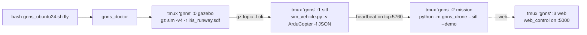

# Ubuntu 24.04 — run the drone end-to-end (tmux-first)

The only supported flow on Ubuntu 24.04 (noble) is **ROS 2 Jazzy + Gazebo Harmonic + ArduPilot SITL**, orchestrated inside a single **tmux** session by `gnns_ubuntu24.sh fly`. The legacy Noetic / Gazebo Classic 11 scripts (`start_simulation.sh`, `sitl/setup_*.sh`) are blocked on 24.04.

> Manual three-terminal use is not recommended. The `fly` command starts Gazebo first, waits for `gz-transport` to be up, starts SITL, waits for the MAVLink heartbeat on `tcp:127.0.0.1:5760`, then starts the mission — in that order. Doing it by hand is fragile.

---

## Step 0 — Prerequisites

1. Fresh Ubuntu 24.04 with `sudo` access.
2. ~10 GB free disk.
3. Internet (apt + GitHub).
4. Clone and enter the repo:
   ```bash
   git clone <your-repo-url> gNNS_drone
   cd gNNS_drone
   ```

All commands below run from the repo root.

---

## Step 1 — One-time install

```bash
bash gnns_ubuntu24.sh install
```

Installs (via [scripts/laptop_ubuntu24/setup_laptop_ubuntu24.sh](../scripts/laptop_ubuntu24/setup_laptop_ubuntu24.sh)):

- apt deps + **tmux** + Python 3.12 / 3.14 venvs
- Intel **librealsense2**
- **ROS 2 Jazzy** desktop + RTAB-Map + realsense2-camera + DDS RMWs
- **ArduPilot** at `~/ardupilot`
- **Gazebo Harmonic** (`gz-harmonic`, `libgz-sim8-dev`, `rapidjson-dev`)
- **ardupilot_gazebo** plugin (`~/gz_ws/src/ardupilot_gazebo/build`)
- Bashrc block: `ROS_DISTRO=jazzy`, `GZ_VERSION=harmonic`, `GZ_SIM_*`, `ardupilot/Tools/autotest` on `PATH`

If your fresh build of `ardupilot_gazebo` ever fails for missing libs, install (Noble names):

```bash
sudo apt-get install -y cppzmq-dev libzmq3-dev libgz-transport13-dev \
  libgstreamer1.0-dev libgstreamer-plugins-base1.0-dev gstreamer1.0-plugins-bad gstreamer1.0-libav gstreamer1.0-gl
```

then `rm -rf ~/gz_ws/src/ardupilot_gazebo/build && bash gnns_ubuntu24.sh install`.

---

## Step 2 — Open a fresh shell

Reload `~/.bashrc` so `ROS_DISTRO`, `GZ_VERSION`, `GZ_SIM_*` and `ardupilot/Tools/autotest` are visible:

```bash
exec bash -l
```

(or just open a new terminal tab). If `install` added you to new groups (`dialout`, `plugdev`, `video`), log out and back in once.

---

## Step 3 — Verify

```bash
bash gnns_ubuntu24.sh doctor
```

Expected end line: `[doctor] All checks passed`. Fix any `[err]` lines before continuing.

Optional MAVROS / geoid check:

```bash
bash gnns_ubuntu24.sh doctor --with-mavros
```

---

## Step 4 — Fly (one command, tmux-driven)

```bash
bash gnns_ubuntu24.sh fly
```

`fly` will:

1. Start **Gazebo Harmonic** in tmux window **`gazebo`** with the `iris_runway.sdf` world.
2. Wait until `gz topic -l` returns topics (Gazebo transport is up).
3. Start **`sim_vehicle.py -v ArduCopter -f JSON`** with the gimbal param file in window **`sitl`**.
4. Wait for **MAVLink heartbeat on `tcp:127.0.0.1:5760`**.
5. Start **`python -m gnns_drone --sitl --demo`** in window **`mission`** and select that window.

Optional flags:

| Flag | Effect |
|---|---|
| `--web` | Add a 4th window running [web_control](../gnns_drone/web_control.py) on `GNNS_WEB_PORT` (default `5000`). |
| `--headless` | Pass `--headless` to `gnns_gazebo` (no GUI). |
| `--no-attach` | Don't attach after starting; use `tmux attach -t gnns` later. |

Examples:

```bash
bash gnns_ubuntu24.sh fly --web                 # adds http://localhost:5000
bash gnns_ubuntu24.sh fly --headless --no-attach
bash gnns_ubuntu24.sh fly --web --headless
```

### Tmux cheatsheet

You're inside tmux once `fly` attaches. Look for the `[gnns]` status bar at the bottom.

| Action | Keys |
|---|---|
| Switch window | `Ctrl+b` then `0` (gazebo) / `1` (sitl) / `2` (mission) / `3` (web) |
| Scroll output | `Ctrl+b` then `[` (then `q` to exit scroll) |
| Detach (keep running) | `Ctrl+b` then `d` |
| Reattach later | `tmux attach -t gnns` |
| Kill the session | `bash gnns_ubuntu24.sh clean` |

Mouse mode is enabled — you can click windows in the status bar and scroll with the wheel.

---

## Step 5 — Inspect / debug

```bash
bash gnns_ubuntu24.sh status
```

Shows: tmux sessions, running `gz` / `sim_vehicle` / `arducopter` / `python -m gnns_drone` processes, and which key ports are listening (`5760`, `14550`, `5000`).

Re-attach to the running session:

```bash
tmux attach -t gnns
```

If the mission exited (and you want to re-run the same `MissionRunner` without restarting Gazebo + SITL), pick the **mission** window and re-run:

```bash
source ~/Downloads/.../gNNS_drone/scripts/laptop_ubuntu24/env.sh   # if needed
source $GNNS_VENV/bin/activate
cd $REPO_ROOT
python -m gnns_drone --sitl --demo
```

---

## Step 6 — Stop everything

```bash
bash gnns_ubuntu24.sh clean
```

Kills the `gnns` tmux session and all `gz sim` / `gz-sim-server` / `sim_vehicle.py` / `arducopter` / `python -m gnns_drone` processes.

---

## Useful environment overrides

| Variable | Default | Purpose |
|---|---|---|
| `ARDUPILOT_HOME` | `$HOME/ardupilot` | ArduPilot checkout |
| `GZ_PLUGIN` | `$HOME/gz_ws/src/ardupilot_gazebo` | ardupilot_gazebo checkout |
| `GNNS_VENV` | `<repo>/.venv-py312` | venv used for mission/web |
| `GNNS_TMUX_SESSION` | `gnns` | tmux session name |
| `GNNS_WEB_PORT` | `5000` | web UI port |
| `GNNS_GAZEBO_TIMEOUT` | `60` | seconds to wait for `gz topic -l` |
| `GNNS_SITL_TIMEOUT` | `120` | seconds to wait for MAVLink heartbeat |

Source the env yourself if you want the `gnns_*` helpers in your interactive shell:

```bash
source scripts/laptop_ubuntu24/env.sh
gnns_doctor
gnns_fly --web
```

---

## Troubleshooting

| Symptom | Where | Fix |
|---|---|---|
| `gz: command not found` | doctor | `bash gnns_ubuntu24.sh install` then `exec bash -l`. |
| `Missing libArduPilotPlugin.so` | doctor | Rebuild: `cd $HOME/gz_ws/src/ardupilot_gazebo && rm -rf build && mkdir build && cd build && GZ_VERSION=harmonic cmake .. && make -j$(nproc)`. |
| `CPPZMQ::CPPZMQ not found` | building plugin | `sudo apt-get install -y cppzmq-dev libzmq3-dev libgz-transport13-dev`, then re-cmake. |
| `gst*` not found | building plugin | `sudo apt-get install -y libgstreamer1.0-dev libgstreamer-plugins-base1.0-dev gstreamer1.0-plugins-bad gstreamer1.0-libav gstreamer1.0-gl`. |
| `Gazebo did not come up` from `fly` | orchestrator | Attach: `tmux attach -t gnns`, switch to **gazebo** window (`Ctrl+b 0`). Likely a GPU/`DISPLAY` issue — try `--headless`. |
| `No heartbeat` from `fly` | orchestrator | Switch to **sitl** window (`Ctrl+b 1`) and read errors; check the **gazebo** window is alive. |
| “waiting for connection” in SITL forever | sitl window | Gazebo isn't really up. `clean`, then `fly` again — `fly` only starts SITL after `gz topic -l` succeeds. |
| Legacy script refuses on 24.04 | running `start_simulation.sh` | Expected. Use `gnns_ubuntu24.sh`. |

---

## Architecture (what `fly` actually does)


